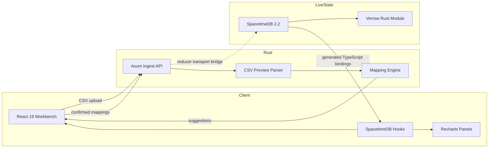
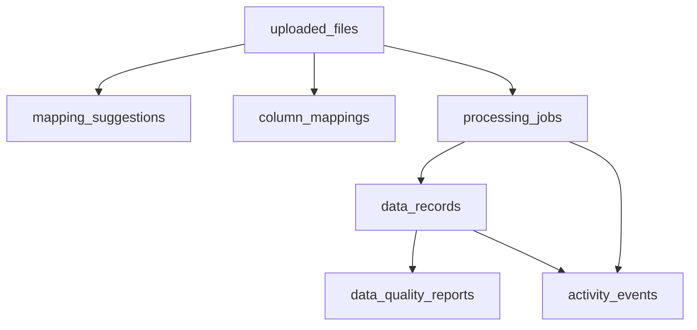

# Architecture: Verrow

**Last Updated:** 2026-05-15

## Overview

Verrow is a lead data workbench for ingesting CSV files, mapping inconsistent columns into a standard schema, validating records, scoring quality, and exploring datasets through dashboards, charts, filters, and query surfaces.

The architecture is intentionally narrow:

- React owns the workbench experience.
- Rust owns CSV upload, preview, mapping suggestions, validation, and sidecar work.
- SpacetimeDB owns live application state, reducers, and subscriptions.

## System Shape

## Components

- **Frontend:** Upload workbench, mapping review, dashboard, data browser, dataset screens, query surface, settings, and chart components.
- **Rust ingest API:** Multipart upload, CSV sampling, header extraction, heuristic mapping, confirmation validation, and reducer receipt responses.
- **SpacetimeDB module:** Tables and reducers for uploads, suggestions, mappings, jobs, records, activity events, and quality reports.
- **Shared types:** Lead schema and mapping types shared across frontend surfaces.

## Runtime Flow

1. User uploads a CSV through the React workbench.
2. The Rust ingest API accepts multipart upload and samples rows.
3. The mapping engine suggests field mappings using header and sample-value heuristics.
4. The user reviews mappings and confirms target fields.
5. The Rust ingest API validates the confirmation and records reducer intent.
6. SpacetimeDB reducers store live upload, job, record, quality, and activity state.
7. React subscribes to generated bindings for live updates.

Current status: steps 1-5 are implemented in the Rust sidecar. The SpacetimeDB module has the tables and reducers. The remaining backend milestone is replacing the no-op reducer transport with a real SpacetimeDB client bridge.

## State Model

## Lead Schema

The standard lead schema covers:

- Identity: full name, first name, last name.
- Contact: email, phone, website.
- Company: business name, job title, industry, description.
- Location: address, city, state, postal code, country.
- Classification: lead type, quality score, source file, batch metadata, and additional JSON data.

## Testing Strategy

- Rust unit tests cover CSV preview, mapping heuristics, and reducer receipt behavior.
- Frontend checks cover TypeScript, Vite build, Vite+ build, and Vite+ linting.
- Secret scanning is required before publishing or pushing release branches.

## Release Boundary

The public repository should stay focused on source code, docs, sanitized fixtures, and lockfiles. Do not add deployment credentials, private environment files, generated build output, uploaded lead data, or CI/CD workflows without explicit maintainer approval.
