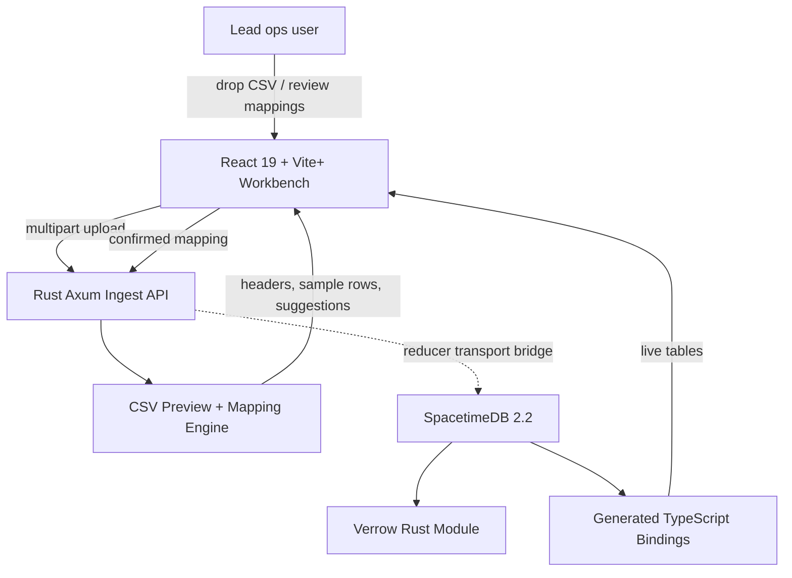
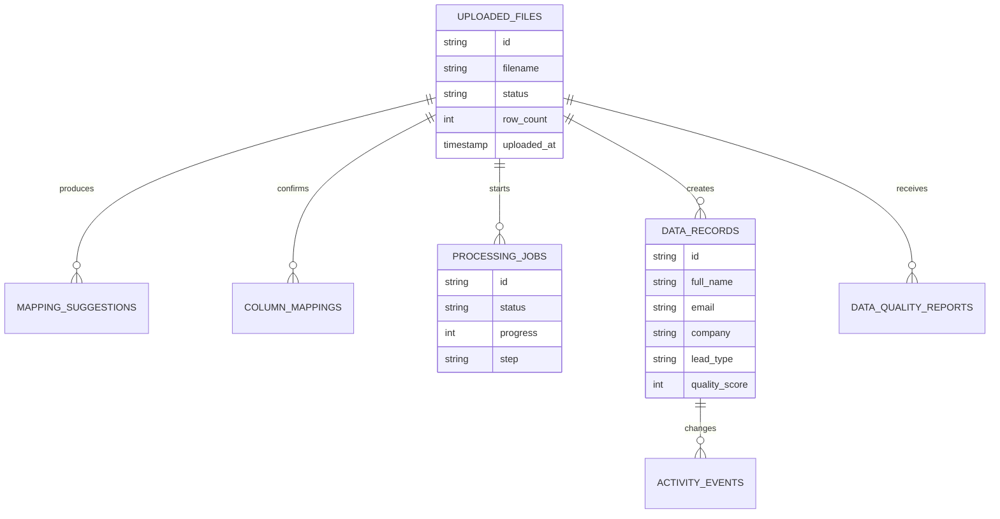

# Verrow

Turn raw lead files into trusted records.


Verrow is an open-source lead data workbench for messy CSV files from vendors, forms, exports, research lists, scrape jobs, and old CRMs. It helps teams upload files, understand columns, map records into a standard lead schema, score quality, review datasets, and move toward live operational data without burying the workflow in a generic spreadsheet tool.

The rebooted stack is focused and current: **React 19**, **TypeScript 6**, **Material UI 9**, **Vite 8 / Vite+**, **Rust Axum**, and **SpacetimeDB 2.2**. No CI/CD is included.

## Feature Highlights

| Area | What Verrow Does | Status |
| --- | --- | --- |
| CSV ingestion | Uploads CSV files through the Rust ingest API, samples rows, extracts headers, and reports parser warnings. | Implemented |
| Column mapping | Suggests source-to-schema mappings using deterministic heuristics and sample-value patterns. | Implemented |
| Human review | Lets users confirm mappings before processing intent is accepted. | Implemented |
| Data quality | Defines quality-report tables and UI surfaces for completeness, cleaning suggestions, anomalies, and score review. | UI and schema ready |
| Datasets | Provides dataset pages, detail views, file management surfaces, and relationship components. | UI ready |
| Dashboards | Includes operational dashboard cards, activity surfaces, and Recharts-powered visualization components. | UI ready |
| Query workflow | Provides a natural-language-style query surface for records once live records are available. | UI ready |
| Live state | Defines SpacetimeDB tables, reducers, and generated TypeScript bindings for uploads, mappings, jobs, records, activity, and reports. | Module ready |
| Rust services | Ships an Axum sidecar for upload, preview, mapping suggestions, confirmation, and process-intent receipts. | Implemented |
| Branding/docs | Includes logo, favicon, social card, banner, feature docs, API docs, Mermaid diagrams, security policy, and contribution guide. | Ready |

## Product Workflow


## Runtime Architecture



## Data Model



## What Is In The App

- Upload workbench with drag-and-drop CSV intake, progress, and next-step routing.
- Mapping review screen for source columns, target schema fields, confidence, and confirmation.
- Dashboard with file status, activity, insights, and visualization panels.
- Dataset list and detail screens for organizing batches of lead files.
- Data browser with filtering, deletion affordances, and empty/error states.
- Analysis/query screen for turning records into answers once live records are flowing.
- Settings for mapping behavior and optional provider-backed mapping experiments.
- SpacetimeDB provider and hooks for files, jobs, records, activity, and connection status.

## Quick Start

```bash
cp .env.example .env
docker compose up --build
```

Then open:

- Frontend: http://localhost:5173
- Rust ingest health check: http://localhost:3010/health
- SpacetimeDB: http://localhost:3001

## Local Development

Install frontend dependencies:

```bash
npm ci --prefix frontend
```

Run the Rust ingest API:

```bash
cargo run --manifest-path rust-services/ingest-api/Cargo.toml
```

Run the frontend:

```bash
npm run dev --prefix frontend
```

Useful project commands:

```bash
npm run build
npm run rust:test
npm run rust:check
npm run spacetime:build
npm run spacetime:generate
npm run docker:up
```

Vite+ commands are available in the frontend package:

```bash
npm run check:vite-plus --prefix frontend
npm run build:vite-plus --prefix frontend
npm run lint:vite-plus --prefix frontend
```

## API Highlights

- `GET /health` returns Rust ingest health and reducer transport state.
- `POST /v1/csv/uploads` uploads a CSV, samples rows, and returns mapping suggestions.
- `POST /v1/mapping/suggestions` returns heuristic mapping suggestions for supplied headers.
- `POST /v1/uploads/:upload_id/confirm` validates confirmed mappings and records reducer intent.
- `POST /v1/uploads/:upload_id/process` records processing intent for the upload.

## Project Status

Verrow currently has a working Rust upload and mapping path plus a SpacetimeDB module with the live tables and reducers the product needs. The remaining backend milestone is replacing the Rust sidecar's no-op reducer transport with a real SpacetimeDB client bridge so confirmed uploads produce live `data_records`, quality reports, job progress, and activity events.

The UI already contains the broader workbench surface so the product direction is visible: upload, mapping, dashboards, charts, datasets, data browsing, query, settings, and live-state hooks.

## Repository Layout

```text
frontend/       React workbench, dashboard, charts, upload and mapping UI
rust-services/  Rust sidecars, starting with the Axum ingest API
spacetimedb/    SpacetimeDB Rust module for live tables and reducers
shared/         Shared TypeScript lead-data types
docs/           Features, API docs, architecture diagrams, roadmap, brand notes
```

## Documentation

- [Features](docs/features.md)
- [API](docs/api.md)
- [Architecture](ARCHITECTURE.md)
- [Sequence diagrams](docs/sequence-diagrams.md)
- [Roadmap](docs/roadmap.md)
- [Brand](docs/brand.md)
- [Security](SECURITY.md)
- [Contributing](CONTRIBUTING.md)

## License

MIT. See [LICENSE](LICENSE).
