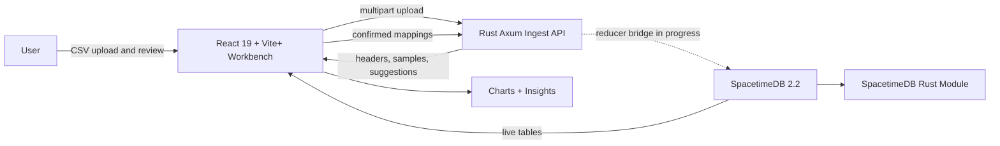

# Verrow Documentation

This directory contains the public project documentation for Verrow.

## Start Here

- `features.md`: Product capabilities and current feature coverage.
- `api.md`: Rust ingest API reference and examples.
- `roadmap.md`: Ready, in-progress, and later work.
- `brand.md`: Name, positioning, visual assets, and brand notes.
- `open-source-release-checklist.md`: Final checks before publishing.

## Architecture

- `../ARCHITECTURE.md`: System overview and component responsibilities.
- `sequence-diagrams.md`: Mermaid sequence and flow diagrams.
- `spacetime-rust-vertical-slice.md`: Rust + SpacetimeDB runtime notes.

## System Schematic

## Current Runtime

The default Docker Compose stack starts:

- `frontend`
- `rust-ingest-api`
- `spacetimedb`
- `spacetimedb-init`

No CI/CD workflow is included in this repository.
