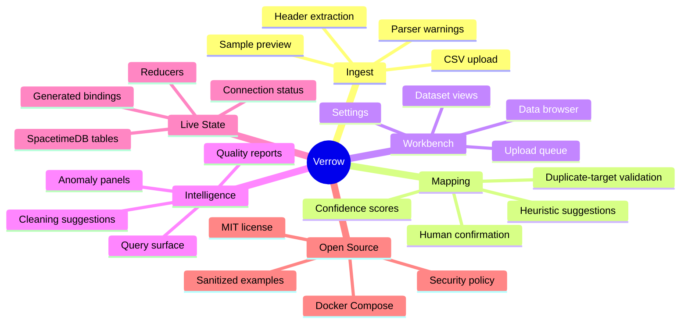

# Features

Verrow focuses on one workflow: turning inconsistent lead CSV files into trusted records that can be reviewed, charted, queried, cleaned, and exported.

## Feature Map

## CSV Ingestion

- Upload CSV files through the Rust Axum ingest API.
- Extract headers and preview sample rows before mapping.
- Return observed row counts and parser warnings when available.
- Bound upload size through `INGEST_API_MAX_UPLOAD_BYTES`.

## Column Mapping

- Suggest mappings from source columns into a standard lead schema.
- Use header heuristics for common fields such as name, email, phone, company, title, website, industry, city, state, postal code, and lead type.
- Use sample-value patterns to improve confidence for email, phone, URL, postal code, and full-name fields.
- Require human confirmation before process intent is accepted.
- Reject empty mappings, unknown source columns, and duplicate target fields.

## Workbench UI

- React workbench for upload, mapping, dashboard, data, query, datasets, and settings screens.
- Material UI layout with responsive navigation.
- Status chips show whether live SpacetimeDB subscriptions are enabled.
- Upload queue shows selected files, status, progress, and next actions.
- Dataset and file surfaces organize batches of related lead files.
- Brand assets are included for README, app shell, favicon, and social cards.

## Charts And Analysis

- Recharts components for bar, donut, aggregate, time-series, and distribution views.
- Data completeness cards for fast quality review.
- Cleaning suggestion and anomaly panels for operational follow-up.
- Dashboard surfaces for file status, recent activity, and data insights.
- Query screen for asking record-focused questions once live records are available.

## SpacetimeDB Path

- Rust module defines tables for uploads, mapping suggestions, column mappings, processing jobs, data records, activity events, and data quality reports.
- Reducers exist for registering uploads, recording suggestions, confirming mappings, staging CSV uploads, processing uploads, updating jobs, inserting records, deleting records, recording activity, and recording quality reports.
- The current ingest API records reducer intent through an abstract transport.
- The current transport is intentionally no-op until the real SpacetimeDB client bridge is implemented.

## Open-Source Readiness

- MIT license.
- Contribution guide.
- Security policy.
- Docker Compose quick start.
- Sanitized environment examples.
- Mermaid architecture and sequence diagrams.
- Open-source release checklist.
