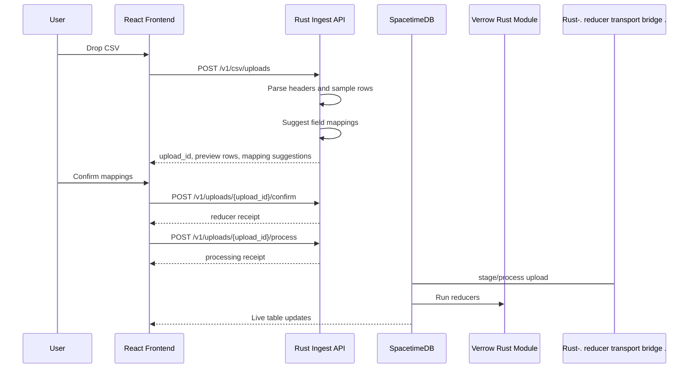
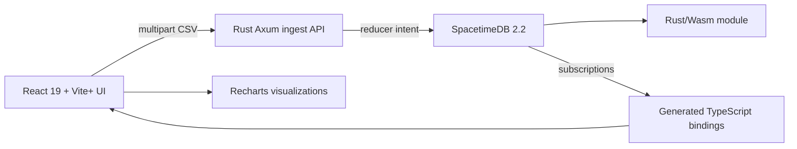
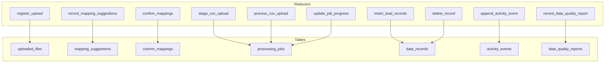

# Verrow Sequence Diagrams

These diagrams describe the default Verrow architecture: React/Vite+ frontend, Rust Axum ingest API, and SpacetimeDB reducers/subscriptions.

## Upload And Mapping

## Live State Ownership

## Tables And Reducers

