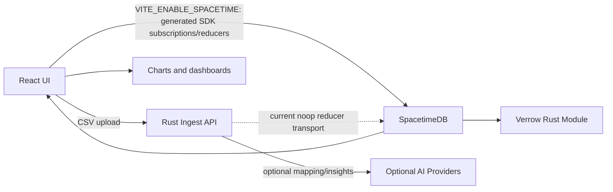

# SpacetimeDB + Rust Runtime

Verrow keeps ingestion in Rust and live state in SpacetimeDB. That split keeps heavy CSV and provider work out of reducers while still giving the frontend live tables and generated TypeScript bindings.

## Why This Fits

Verrow has a naturally live workflow:

- CSV uploads appear as files.
- Header extraction creates mapping suggestions.
- Mapping confirmation starts processing jobs.
- Jobs emit progress updates.
- Records, quality reports, activities, and dashboards change as processing runs.

SpacetimeDB turns those changes into subscriptions instead of polling. That makes the product feel less like a static CRUD dashboard and more like a live lead-data workbench.

## Runtime Version

Target SpacetimeDB release: `v2.2.0`.

Relevant capabilities:

- Rust modules compiled to Wasm.
- TypeScript client generation for the React app.
- Reducers for transactional state changes.
- Public tables/views for live subscriptions.

## Current Runtime



## Boundary Decisions

- SpacetimeDB owns live state: uploaded files, mapping suggestions, confirmed mappings, jobs, records, activity, and quality reports.
- Rust ingest API owns things reducers should not do: multipart upload, filesystem/object storage, CSV streaming, AI calls, and batch processing.
- The Rust ingest API does not currently deliver reducer calls to SpacetimeDB. Its `stage_csv_upload` and `process_csv_upload` responses are no-op transport receipts with `delivered_to_spacetimedb: false`; a real Rust SDK client still needs to replace that transport.
- React stays as the client and switches through feature flags.

## Roadmap

1. Keep SpacetimeDB module tables and reducers building locally.
2. Keep the Rust ingest API owning health, upload, suggest, confirm, and process-intent endpoints.
3. Maintain the frontend SpacetimeDB provider generated from the v2.2 TypeScript SDK behind `VITE_ENABLE_SPACETIME`.
4. Keep Docker Compose focused on SpacetimeDB, the Rust ingest API, and the frontend.
5. Replace the Rust ingest API no-op reducer transport with a real Rust SDK client.
6. Move live UI surfaces to subscriptions for files, jobs, records, and activity.
7. Finish end-to-end processing into live `data_records`.

## Local Commands

Install Rust and SpacetimeDB CLI first.

```bash
rustup target add wasm32-unknown-unknown
npm run dev:spacetime
spacetime publish --module-path spacetimedb/module verrow
spacetime generate --module-path spacetimedb/module --lang typescript --out-dir frontend/src/spacetime/bindings -y
```

Rust ingest API:

```bash
npm run dev:rust-ingest
```

Docker Compose:

```bash
cp .env.example .env
docker compose up --build spacetimedb spacetimedb-init rust-ingest-api
```

Frontend live mode:

```bash
VITE_ENABLE_SPACETIME=true npm run dev --prefix frontend
```

`VITE_ENABLE_SPACETIME` is reserved for the generated SpacetimeDB v2.2 bindings and `SpacetimeProvider`.
